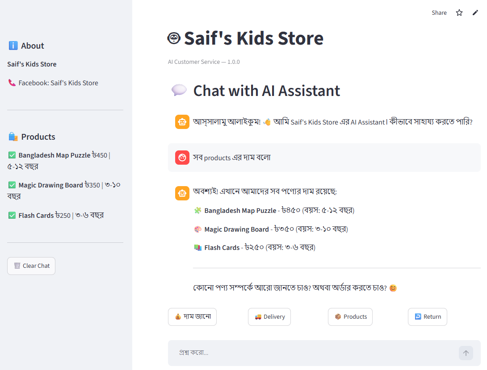

# 🤖 AI-Powered Customer Service Chatbot

Short one-line description

[🚀 Live Demo] [📂 GitHub]

## 📸 Demo

asset

## 🎯 Problem

Small businesses receive repetitive questions about:
- Products
- Prices
- Delivery
- Returns
- FAQs

## 💡 Solution

This chatbot uses Claude AI + RAG to answer
customer questions using the business's own knowledge base.

## ✨ Features

...

## 🧠 How It Works

Customer Question
       ↓
Query Processing
       ↓
RAG Retrieval
       ↓
Relevant Business Information
       ↓
Claude AI
       ↓
Customer Response

## 🛠️ Tech Stack

## 📁 Project Structure

## 🚀 Local Setup

## 🌐 Live Demo

## 🔧 Customization

## 👨‍💻 Author